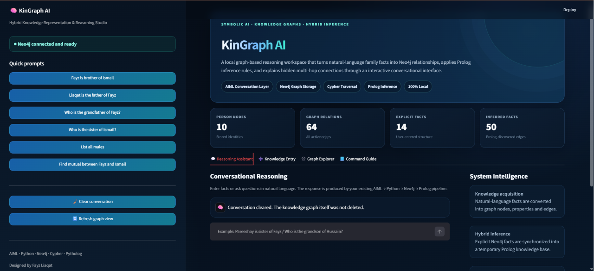
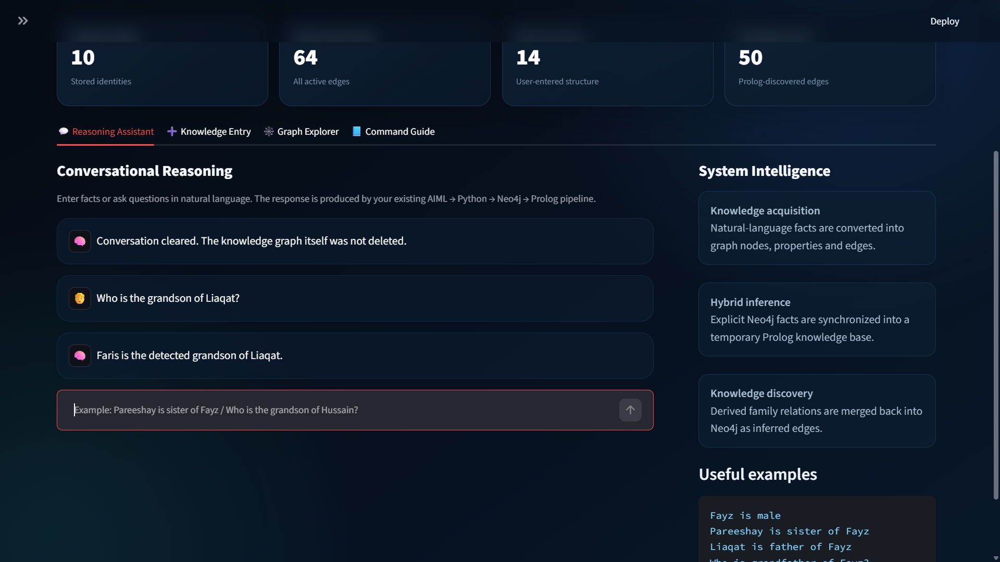
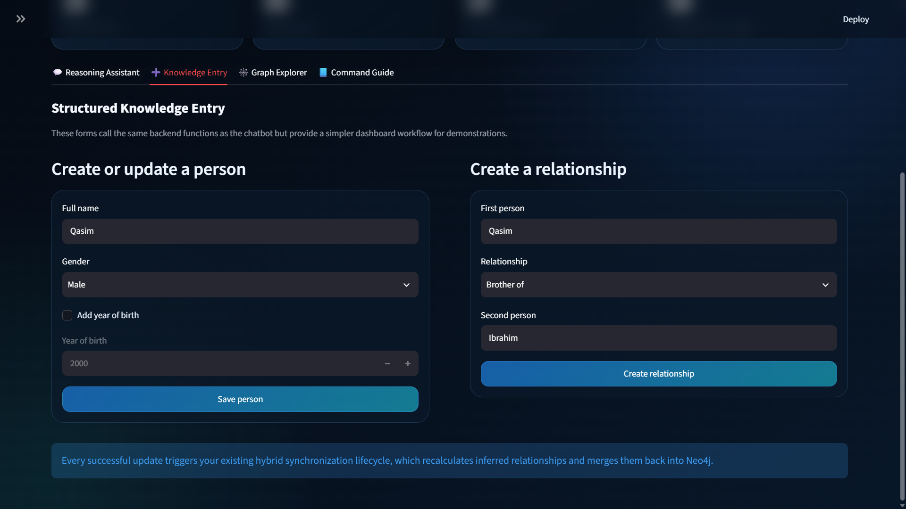
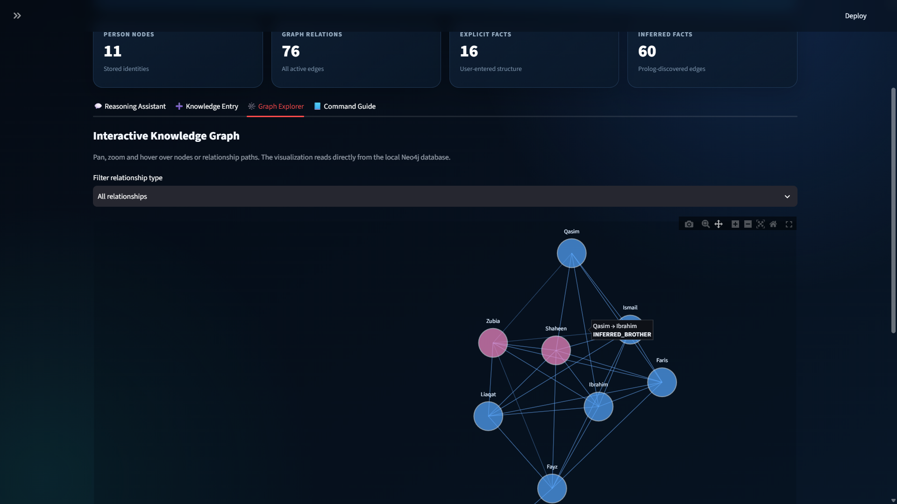
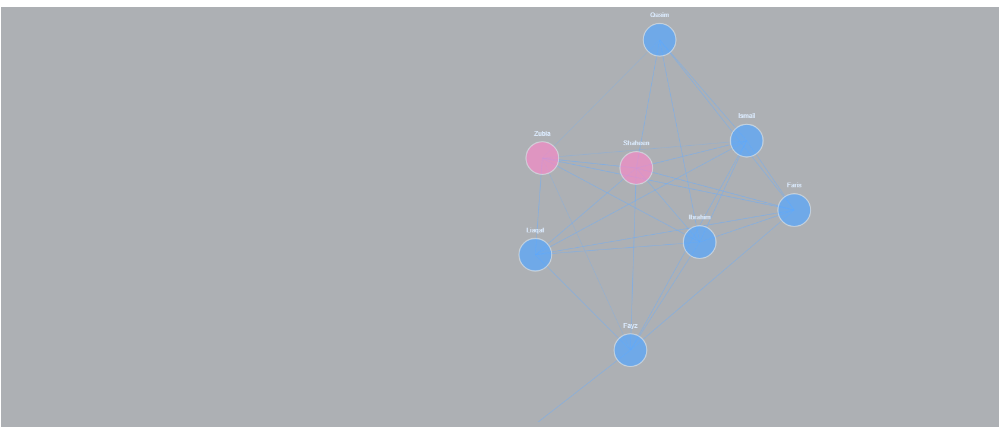
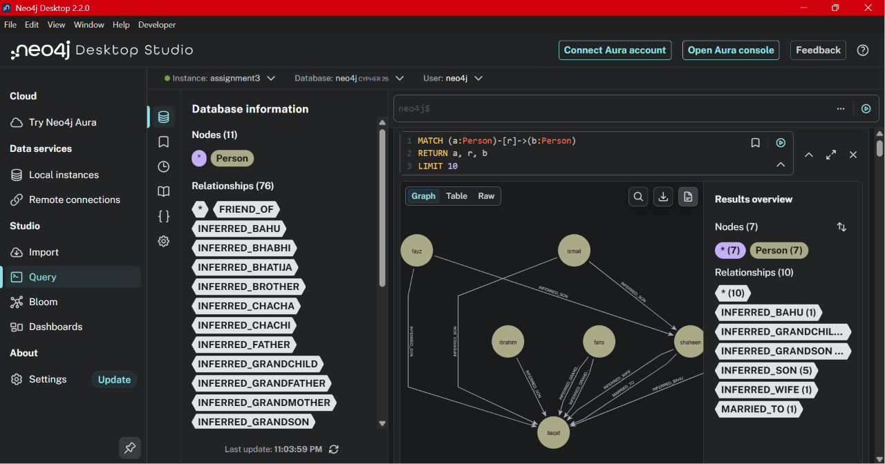
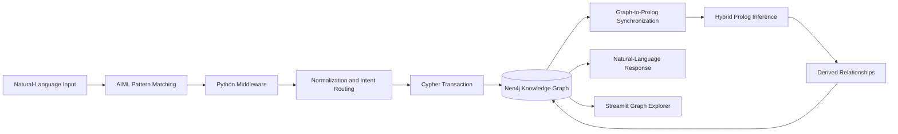

# 🧠 KinGraph AI

<p align="center">
  <strong>A hybrid symbolic AI system for natural-language knowledge acquisition, Neo4j graph storage, Cypher traversal, and Prolog-based multi-hop inference.</strong>
</p>

<p align="center">
  
  
  
  
  
  
</p>

---

## 📌 Overview

**KinGraph AI** is a local Knowledge Representation and Reasoning system that converts natural-language family facts into a persistent Neo4j knowledge graph.

The system combines:

- **AIML** for conversational pattern matching;
- **Python** for normalization, orchestration and query routing;
- **Neo4j** for graph-based knowledge storage;
- **Cypher** for graph creation and traversal;
- **Pytholog/Prolog** for symbolic multi-hop inference;
- **Streamlit** for an interactive reasoning and graph-exploration interface.

A user can add facts such as:

```text
Liaqat is the father of Fayz
Fayz is the brother of Ismail
Pareeshay is the sister of Fayz
```

and then ask questions whose answers were never entered directly:

```text
Who is the grandson of Liaqat?
Who is the sister of Ismail?
Who is the grandfather of Fayz?
```

KinGraph AI discovers the answer by combining explicit graph facts with symbolic inference rules.

---

## 🚀 Why This Project Is Different

Many chatbot projects only match a question to a hardcoded reply.

KinGraph AI instead maintains a **living knowledge graph**:

1. Natural-language statements create or update Neo4j nodes and relationships.
2. Explicit graph facts are converted into temporary Prolog facts.
3. A symbolic ruleset derives hidden family relationships.
4. Derived facts are merged back into Neo4j as `INFERRED_*` edges.
5. The updated graph can immediately answer new multi-hop questions.

The application therefore supports both:

- **knowledge acquisition** — storing new facts;
- **knowledge discovery** — deriving facts that were never explicitly entered.

---

## 🖼️ System Demonstration

### 1. Hybrid Reasoning Studio

The main dashboard reports the live state of the knowledge graph and provides quick prompts, conversational reasoning, system explanations and navigation between all project modules.

At the captured state, the graph contains:

- **10 person nodes**
- **64 active relationships**
- **14 explicit facts**
- **50 Prolog-inferred facts**



The large difference between explicit and inferred facts demonstrates that the system is not merely storing user input. It is actively discovering additional relationships through symbolic rules.

---

### 2. Multi-Hop Conversational Reasoning

The Reasoning Assistant accepts natural-language questions and returns answers through the complete:

```text
AIML → Python → Neo4j → Prolog
```

pipeline.

In this example, the user asks:

```text
Who is the grandson of Liaqat?
```

The system responds:

```text
Faris is the detected grandson of Liaqat.
```

This relationship is derived from previously stored family links rather than a directly entered `grandson` fact.



---

### 3. Structured Knowledge Entry

The dashboard provides forms for users who prefer structured input over chatbot commands.

The interface can:

- create or update a person;
- store gender;
- optionally store year of birth;
- create parent, sibling, marriage or friendship relationships;
- trigger the full hybrid synchronization lifecycle after every update.



The screenshot shows the creation of **Qasim** and a new `Brother of` relationship with **Ibrahim**.

---

### 4. Automatic Inference Expansion

After adding the new person and relationship, the graph changes from:

| Metric | Before | After | Increase |
|---|---:|---:|---:|
| Person Nodes | 10 | 11 | +1 |
| Graph Relationships | 64 | 76 | +12 |
| Explicit Facts | 14 | 16 | +2 |
| Inferred Facts | 50 | 60 | +10 |

Only two new explicit structural facts were added, but the Prolog lifecycle discovered **10 additional inferred relationships**.

This is one of the clearest demonstrations of the system's knowledge-discovery capability.

---

### 5. Interactive Streamlit Graph Explorer

The Graph Explorer reads directly from Neo4j and renders a live interactive network.

Features include:

- pan and zoom;
- node hover details;
- relationship hover details;
- relationship-type filtering;
- gender-based node colors;
- node size based on connectivity;
- explicit and inferred relationship display;
- person-node and edge data tables.



The highlighted hover state shows an inferred edge:

```text
Qasim → Ibrahim
INFERRED_BROTHER
```

---

### 6. Clean Knowledge Graph Visualization

The graph can also be viewed as a clean standalone network visualization.

- Blue nodes represent male entities.
- Pink nodes represent female entities.
- Node labels identify people.
- Edges represent explicit or inferred family relationships.



---

### 7. Native Neo4j Persistence

The same graph is stored in the local Neo4j database and can be inspected independently through Neo4j Desktop.

The screenshot confirms:

- **11 stored nodes**
- **76 relationships**
- explicit edges such as `MARRIED_TO`;
- derived edges such as `INFERRED_SON`, `INFERRED_WIFE`,
  `INFERRED_GRANDSON`, `INFERRED_GRANDCHILD` and others.



This demonstrates that Streamlit is not displaying a mock or separate graph. Both the dashboard and Neo4j Desktop are reading the same persistent graph state.

---

## 🏗️ System Architecture



---

## 🔄 Hybrid Inference Lifecycle

### Step 1 — Acquire Knowledge

A user enters a fact:

```text
Pareeshay is the sister of Fayz
```

AIML extracts the relevant slots and dispatches a structured update token.

### Step 2 — Write Explicit Graph Facts

Python translates the extracted entities into a Cypher transaction:

```cypher
MERGE (p1:Person {name: "pareeshay"})
SET p1.gender = "female",
    p1.display_name = "Pareeshay"

MERGE (p2:Person {name: "fayz"})
SET p2.display_name = "Fayz"

MERGE (p1)-[:SIBLING_OF]->(p2)
MERGE (p2)-[:SIBLING_OF]->(p1)
```

### Step 3 — Build a Temporary Prolog Knowledge Base

The middleware reads Neo4j primitives such as:

```text
parent(X, Y)
sibling(X, Y)
married(X, Y)
male(X)
female(X)
```

and combines them with the project's Prolog rules.

### Step 4 — Infer Hidden Relationships

The logic engine evaluates relations such as:

```prolog
brother(X, Y)
sister(X, Y)
grandfather(X, Y)
grandson(X, Y)
cousin(X, Y)
chacha(X, Y)
khala(X, Y)
ancestor(X, Y)
```

### Step 5 — Merge Inferences Back into Neo4j

Validated derivations are stored as graph edges:

```text
INFERRED_BROTHER
INFERRED_GRANDSON
INFERRED_GRANDFATHER
INFERRED_COUSIN
```

### Step 6 — Answer Questions

The conversation layer returns a readable response instead of raw graph records.

---

## 🧠 Knowledge and Reasoning Coverage

### Explicit Base Relationships

| Neo4j Relationship | Meaning |
|---|---|
| `PARENT_OF` | Directed parent-to-child relationship |
| `MARRIED_TO` | Bidirectional marriage relationship |
| `SIBLING_OF` | Bidirectional sibling relationship |
| `FRIEND_OF` | Bidirectional friendship relationship |

### Core Inferred Relationships

- father and mother
- son and daughter
- brother and sister
- husband, wife and spouse
- grandfather and grandmother
- grandson and granddaughter
- grandchild
- paternal grandparents: dada and dadi
- maternal grandparents: nana and nani

### Extended Family Inference

- chacha and taya
- phupho
- mama/maamu and khala
- chachi, tai, phupha, mami and khalu
- sasur and saas
- bhabhi and bahnoi
- bahu and damad
- bhatija, bhatiji, bhanja and bhanji
- nephew and niece
- cousin
- great-grandfather and great-grandmother
- great-uncle and great-aunt
- cousin once removed
- ancestor and descendant

---

## 🛡️ Reasoning and Data-Integrity Protections

The middleware includes safeguards for:

- self-relationships;
- duplicate node creation;
- gender conflicts;
- invalid year values;
- family-cycle creation;
- recursive self-loop inference;
- Pytholog unbound-variable failures;
- broad recursive sibling-loop traps;
- safe local Neo4j driver reuse;
- graceful graph-driver closure.

---

## ✨ Application Features

### Reasoning Assistant

- add facts using natural language;
- ask identity and relationship questions;
- verify whether a relationship exists;
- list stored entities;
- run multi-hop reasoning queries;
- preserve conversation history;
- use quick example prompts.

### Structured Knowledge Entry

- create a person;
- assign gender;
- store year of birth;
- create a parent relationship;
- create a sibling relationship;
- create a marriage relationship;
- create a friendship relationship;
- immediately trigger graph synchronization and inference.

### Graph Explorer

- interactive Plotly/NetworkX visualization;
- direct Neo4j data retrieval;
- relationship filtering;
- node and edge hover information;
- gender-based coloring;
- degree-based node sizing;
- separate node and relationship tables.

### Command Guide

- supported data-entry examples;
- supported query examples;
- system commands;
- inference-coverage reference.

---

## 🛠️ Technology Stack

| Layer | Technology | Purpose |
|---|---|---|
| User Interface | Streamlit | Interactive reasoning studio |
| Conversation | AIML | Pattern matching and slot extraction |
| Middleware | Python | Routing, normalization and orchestration |
| Graph Database | Neo4j | Persistent node-edge knowledge storage |
| Query Language | Cypher | Graph transactions and traversal |
| Logic Engine | Pytholog / Prolog | Symbolic relationship inference |
| Graph Rendering | NetworkX | Graph layout calculation |
| Visualization | Plotly | Interactive graph rendering |
| Configuration | python-dotenv | Local credential management |

---

## 📁 Repository Structure

```text
KinGraph-AI-Hybrid-Reasoning-System/
│
├── app.py
├── main.py
├── middle_layer.py
├── family_kb.pl
├── chat.aiml
├── dataentry.aiml
│
├── requirements.txt
├── .env.example
├── .gitignore
├── README.md
│
├── screenshots/
│   ├── 01-dashboard-overview.png
│   ├── 02-hybrid-reasoning-chat.png
│   ├── 03-structured-knowledge-entry.png
│   ├── 04-streamlit-graph-explorer.png
│   ├── 05-knowledge-graph-visualization.png
│   └── 06-neo4j-desktop-graph.png
│
└── docs/
    └── project-report.pdf
```

---

## 🚀 Local Setup Guide

### 1. Prerequisites

Install:

- Python 3.10 or newer
- Neo4j Desktop
- Git

### 2. Clone the Repository

```bash
git clone https://github.com/fayzliaqat/KinGraph-AI-Hybrid-Reasoning-System.git
cd KinGraph-AI-Hybrid-Reasoning-System
```

### 3. Create a Virtual Environment

#### Windows

```bash
python -m venv .venv
.venv\Scripts\activate
```

#### macOS / Linux

```bash
python3 -m venv .venv
source .venv/bin/activate
```

### 4. Install Dependencies

```bash
pip install -r requirements.txt
```

### 5. Configure Neo4j Credentials

Copy:

```text
.env.example
```

to:

```text
.env
```

Then add your local Neo4j credentials:

```env
NEO4J_URI=neo4j://127.0.0.1:7687
NEO4J_USER=neo4j
NEO4J_PASSWORD=your_local_neo4j_password
```

Never upload `.env` to GitHub.

### 6. Start Neo4j

1. Open Neo4j Desktop.
2. Create or select a local database.
3. Start the database.
4. Confirm that its Bolt/Neo4j URI matches the value in `.env`.

### 7. Test the Console Version

```bash
python main.py
```

### 8. Start the Streamlit Application

```bash
streamlit run app.py
```

or:

```bash
python -m streamlit run app.py
```

Open:

```text
http://localhost:8501
```

---

## 📦 Requirements

```text
streamlit
neo4j
python-aiml
pytholog
python-dotenv
networkx
plotly
```

---

## 💬 Example Commands

### Add People and Facts

```text
Fayz is male
Pareeshay is female
Fayz is brother of Ismail
Pareeshay is sister of Fayz
Liaqat is father of Fayz
Hussain is father of Liaqat
Ali is married to Sara
Ahmed was born in 2001
```

### Ask Questions

```text
Who is Fayz?
Who is the father of Fayz?
Who is the grandfather of Fayz?
Who is the grandson of Liaqat?
Who is the sister of Ismail?
Who is the chacha of Fayz?
Who is the cousin of Fayz?
Is Fayz the brother of Ismail?
List all males
List all females
Find mutual between Fayz and Ismail
```

---

## 🔍 Useful Neo4j Queries

### Display the Entire Graph

```cypher
MATCH (a:Person)-[r]->(b:Person)
RETURN a, r, b
LIMIT 100
```

### Display Only Explicit Relationships

```cypher
MATCH (a:Person)-[r]->(b:Person)
WHERE NOT type(r) STARTS WITH 'INFERRED_'
RETURN a, r, b
```

### Display Only Inferred Relationships

```cypher
MATCH (a:Person)-[r]->(b:Person)
WHERE type(r) STARTS WITH 'INFERRED_'
RETURN a, r, b
```

### Count Explicit and Inferred Facts

```cypher
MATCH ()-[r]->()
RETURN
    count(r) AS total_relationships,
    sum(
        CASE
            WHEN type(r) STARTS WITH 'INFERRED_'
            THEN 1
            ELSE 0
        END
    ) AS inferred_relationships
```

---

## 🔐 Environment and Security

The public repository must not include real database credentials.

Upload:

```text
.env.example
```

Do not upload:

```text
.env
```

Recommended `.gitignore` rules:

```gitignore
.env
__pycache__/
*.py[cod]
runtime_kb_tmp.pl

.venv/
venv/

.vscode/
.idea/
.DS_Store
Thumbs.db
```

This project is designed for local academic use. Do not store sensitive real-world family information inside a public or shared Neo4j instance.

---

## 📄 Documentation

The academic project report is included as:

```text
docs/project-report.pdf
```

## ✅ Current Status

The current system successfully supports:

- natural-language knowledge acquisition;
- natural-language graph queries;
- persistent Neo4j storage;
- Cypher graph traversal;
- automatic Neo4j-to-Prolog synchronization;
- multi-hop symbolic inference;
- inferred-edge persistence;
- conversational responses;
- interactive dashboard metrics;
- structured knowledge entry;
- live graph exploration;
- local offline execution.

---

## ⚠️ Limitations

- The project currently focuses on a family-relationship domain.
- AIML patterns require known linguistic structures.
- The graph is stored locally and does not include user authentication.
- Prolog synchronization is recalculated after updates and may become expensive on much larger graphs.
- The current system does not provide role-based permissions.
- Graph edge labels can become visually dense as inferred knowledge grows.
- The project is an academic prototype rather than a production genealogy platform.

---

## 🔮 Future Improvements

- add support for additional knowledge domains;
- implement user authentication and access control;
- add graph export to JSON, CSV and GraphML;
- add relationship explanations showing the reasoning path;
- add deletion and editing controls;
- add natural-language Cypher generation;
- add automated unit and integration tests;
- add Docker support for Neo4j and Streamlit;
- add graph-layout selection;
- add search and focus controls for large graphs;
- add contradiction detection across multiple facts;
- add a provenance layer showing whether each relation was entered or inferred;
- deploy a safe demo using a sanitized example graph.

---

## 🏷️ Suggested GitHub Topics

```text
knowledge-graph
knowledge-representation
symbolic-ai
neo4j
prolog
aiml
cypher
graph-database
reasoning-system
expert-system
natural-language-processing
streamlit
python
pytholog
hybrid-ai
```

---

## 👨‍💻 Author

**Fayz Liaqat**  
Bachelor of Science in Artificial Intelligence

---

## 🎓 Academic Context

KinGraph AI was developed as a Knowledge Representation and Reasoning course project. The original assignment required migration from a Prolog-only knowledge base to a Neo4j graph architecture with natural-language storage, retrieval, graph traversal and knowledge discovery.

The project also implements the optional **Hybrid Neo4j–Prolog Reasoning** extension by converting graph facts into Prolog facts, applying inference rules, and writing derived knowledge back to Neo4j.

---

<p align="center">
  <strong>From natural-language facts to a living, reasoning knowledge graph. 🧠🕸️</strong>
</p>
